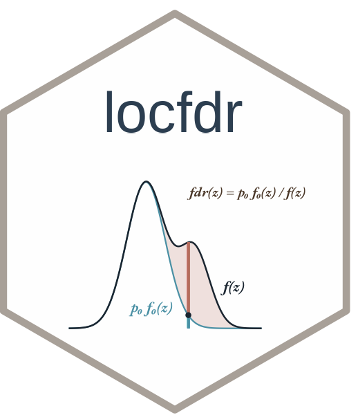

# locfdr 

Computation of Local False Discovery Rates

## Installation

``` r
install.packages("locfdr")
```

## Overview

locfdr computes local false discovery rates following the methodology
of Efron (2004, 2007). Given a vector of z-scores from simultaneous
hypothesis tests, it estimates the mixture density f(z), the null
sub-density p₀f₀(z), and the local false discovery rate
fdr(z) = p₀f₀(z) / f(z).
