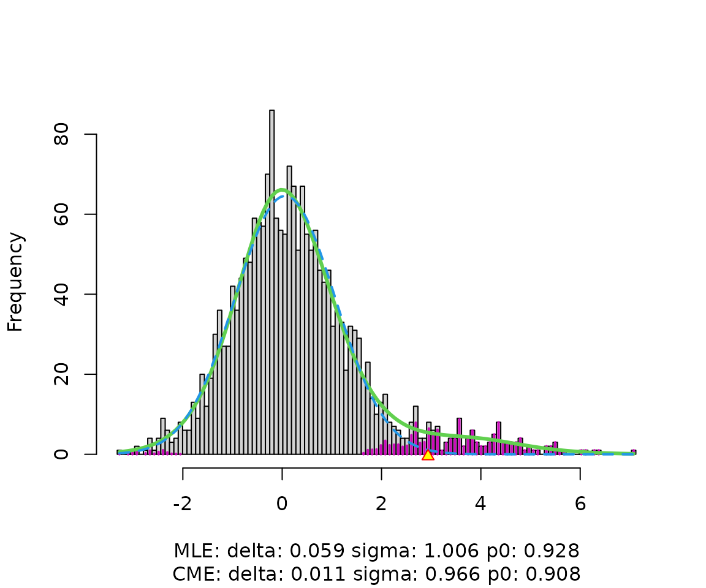

# Local FDR

This vignette includes locfdr’s complete help documentation, including
usage tips, which could not fit in the R help file. It also demonstrates
usage of locfdr through an example using the simulated data included in
the package.

## Description and Usage

locfdr computes local false discovery rates, following the definitions
and description in the references listed below.

    locfdr(zz, bre=120, df=7, pct=0, pct0=1/4, nulltype=1, type=0, plot=1,
            mult, mlests, main=" ", sw=0)

## Arguments

### zz

zz is a vector of summary statistics, one for each case under
consideration. In a microarray experiment, there would be one element of
zz for each gene, perhaps a $t$-statistic comparing gene expression
levels under two different conditions. The calculations assume a large
number of cases, say `length(zz)` exceeding 200.

Results may be improved by transforming zz so that its elements are
theoretically distributed as $N(0,1)$ under the null hypothesis. For
example, when using $t$-statistics, transform them by
`zz = qnorm(pt(t,df))`. Recentering and rescaling zz may be necessary if
its central histogram looks very far removed from mean 0 and variance 1.

When using a permutation null distribution with sample zperm, transform
the original statistics zorig by `zz = qnorm(ecdf(zperm)(zorig))`. Such
transformation is especially important when the theoretical null option
is invoked (see nulltype below).

### bre

bre is the number of breaks in the discretization of the $z$-score axis,
or a vector of breakpoints fully describing the discretization. If
`length(zz)` is small, such as when the number of cases is less than
about 1000, set bre to a number less than the default of 120.

### df

df is the degrees of freedom for fitting the estimated density $f(z)$
(see type below). Larger values of df may be required if $f(z)$ has
sharp bends or other irregularities. A warning is issued if the fitted
curve does not adequately match the histogram counts. It is a good idea
to use the plot option to view the histogram and fitted curve.

### pct

pct is the excluded tail proportions of zz’s when fitting $f$. The
default `pct=0` includes the full range of zz’s. pct can also be a
2-vector, describing the fitting range.

### pct0

pct0 is the proportion of the zz distribution used in fitting the null
density $f_{0}$ by central matching. If it is a 2-vector, e.g.
`pct0=c(0.25,0.60)`, the range `[pct0[1], pct0[2]]` is used. If a
scalar, `[pct0, 1-pct0]` is used.

### nulltype

nulltype is the type of null hypothesis assumed in estimating $f_{0}$,
for use in the fdr calculations.

- 0 is the theoretical null $N(0,1)$, which assumes that zz has been
  scaled to have a $N(0,1)$ distribution under the null hypothesis.
- 1 (the default) is the empirical null with parameters estimated by
  maximum likelihood.
- 2 is the empirical null with parameters estimated by central matching.
- 3 is a “split normal” version of 2, in which $f_{0}(z)$ is allowed to
  have different scales on the two sides of the maximum.

Unless sw is set to 2 or 3, the theoretical, maximum likelihood, and
central matching estimates all will be output in the matrix fp0, and
both the theoretical and the specified nulltype will be used in the
calculations output in mat, but only the specified nulltype is used in
the calculation of the output fdr (local fdr estimates for every case).

### type

type is the type of fitting used for $f$.

- 0 is a natural spline.
- 1 is a polynomial.

In either case, $f$ is fit with degrees of freedom df (so total degrees
of freedom including the intercept is $\text{df} + 1$).

### plot

plot specifies the plots desired.

- 0 gives no plots.
- 1 (the default) gives a single plot showing the histogram of zz and
  fitted mixture density $f$ (green solid curve) and null subdensity
  $p_{0}f_{0}$ (blue dashed curve). Colored histogram bars indicate
  estimated non-null counts. Yellow triangles on the zz-axis indicate
  threshold values for $\text{fdr}(z) \leq 0.2$, if such cases exist.
- 2 also gives plot of fdr, and the right and left tail area Fdr curves.
- 3 gives instead the $f_{1}$ cdf of the estimated fdr curve.
- 4 gives all three plots.

We recommend setting plot to 1 or greater, to check the fit of
$p_{0}f_{0}$ to the histogram. (If the fit is poor, try a different
nulltype or a different value of the mlests argument.)

### mult

mult is an optional scalar multiple (or vector of multiples) of the
sample size for calculation of the corresponding hypothetical Efdr
value(s).

### mlests

mlests is an optional vector of initial values for
$\left( \delta_{0},\sigma_{0} \right)$ in the maximum likelihood
iteration. In addition, these are used to determine the interval over
which the maximum likelihood estimation is performed. If, for example,
zz was transformed quantile-wise from F statistics, most of zz’s
elements corresponding to interesting features will be positive. To
shift the interval away from such elements, specify a negative initial
value for $\delta_{0}$, the first element of mlests. If the default
results in a poor fit of $p_{0}f_{0}$ to the histogram in the first
plot, try setting mlests to move the estimates toward the values
suggested by the histogram.

### main

main is the main heading for the histogram plot.

### sw

sw determines the type of output desired.

- 2 gives a list consisting of the last 5 values listed under Value
  below.
- 3 gives the square matrix of dimension bre-1 representing the
  influence function of $\log\left( \text{fdr} \right)$. The $(i,j)$
  entry of the matrix is the derivative of
  $\log\left( \text{fdr} \right)$ at the midpoint of bin $i$ with
  respect to the count value of bin $j$.
- Any other value of sw returns a list consisting of the first 7 (8 if
  mult is supplied) values listed below.

## Value

### fdr

fdr is the estimated local false discovery rate for each case, using the
selected type and nulltype.

### fp0

fp0 is a matrix containing the estimated parameters delta (mean of
$f_{0}$), sigma (standard deviation of $f_{0}$), and p0 (proportion of
tests that are null), along with their estimated standard errors. If
`nulltype < 3`, fp0 is a $5 \times 3$ matrix, with columns representing
delta, sigma, and p0 and rows representing nulltypes and estimate
vs. standard error. If `nulltype == 3`, the second column corresponds to
the estimate of sigma for the left side of $f_{0}$, and a fourth column
corresponds to the sigma estimate for the right.

### Efdr

Efdr is the expected local false discovery rate for the non-null cases,
a measure of the experiment’s power. Large values of Efdr, say
`Efdr > 0.4`, indicate low power. Overall Efdr and right and left values
are given, both for the specified nulltype and for nulltype 0. (If
`nulltype == 0`, values are given for nulltypes 1 and 0.)

### cdf1

cdf1 is a $99 \times 2$ matrix giving the estimated cdf of fdr under the
non-null distribution $f_{1}$. Large values of the cdf for small fdr
values indicate good power. Set plot to 3 or 4 to see the plot of cdf1.

### mat

mat is a $\left( \text{bre} - 1 \right) \times 11$ matrix, convenient
for comparisons and plotting. Each row corresponds to a bin of the zz
histogram, and the columns contain the following:

1.  **x**: the midpoint of the bin.
2.  **fdr**: the estimated local false discovery rate at $x$.
3.  **Fdrleft**: the left tail false discovery rate at $x$.
4.  **Fdrright**: the right tail false discovery rate at $x$.
5.  **f**: the mixture density estimate at $x$.
6.  **f0**: the null density estimate at $x$.
7.  **f0theo**: the null density estimate at $x$, using the theoretical
    null $N(0,1)$.
8.  **fdrtheo**: the local false discovery rate at $x$, using
    `nulltype=0`.
9.  **counts**: the number of elements of zz in the bin.
10. **lfdrse**: the delta-method estimate of the standard error of the
    log of the local false discovery rate.
11. **p1f1**: the estimated subdensity of the non-null zz elements.

### z.2

z.2 is the interval along the zz-axis outside of which
$\text{fdr}(z) < 0.2$, the locations of the yellow triangles in the
histogram plot. If no elements of zz on the left or right satisfy the
criterion, the corresponding element of z.2 is NA, and the corresponding
triangle does not appear.

### call

call is the function call.

### mult

If the argument mult was supplied, the value mult is the vector of the
ratios of the hypothetical Efdr for the supplied multiples of the sample
size to the Efdr for the actual sample size.

### pds

pds is the vector of estimates of p0, delta, and sigma.

### x

x is the vector of bin midpoints.

### f

f is the vector of estimated values of $f(x)$ at the bin midpoints.

### pds.

pds. is the derivative of the estimates of p0, delta, and sigma with
respect to the bin counts.

### stdev

stdev is the vector of delta-method estimates of the standard deviations
of the p0, delta, and sigma estimates.

## Simulation Example

This simulation example involves 2000 “genes”, each of which has yielded
a test statistic $z_{i}$, with $z_{i} \sim N\left( \mu_{i},1 \right)$,
independently for $i = 1,2,\ldots,2000$.

Here $\mu_{i}$ is the “true score” of gene $i$, which we observe only
noisily. 1800 (90%) of the $\mu_{i}$ values are zero; the remaining 200
(10%) are from a $N(3,1)$ distribution. The data are contained in the
dataset `lfdrsim`, where the $z_{i}$ are the column `zex`.

``` r
library(locfdr)
data(lfdrsim)
zex <- lfdrsim[, 2]
```

If we are confident that the null $z_{i}$’s are distributed as $N(0,1)$,
we run `locfdr` with `nulltype=0`. Otherwise, we use the default
`nulltype=1`, which uses empirical estimates of the null density
parameters.

``` r
w <- locfdr(zex)
```



In the figure, the green solid line is the spline-based estimate of the
mixture density $f$. The blue dashed line is the null subdensity
$p_{0}f_{0}$, estimated by default by maximum likelihood (nulltype=1).
Whichever nulltype is specified, `locfdr` returns a matrix `fp0`
containing parameters of all three nulltypes and corresponding estimates
of the proportion $p_{0}$ of cases that are null, along with standard
errors. In this example, the null distribution is $N(0,1)$, and both the
MLE and central matching estimates come close to this.

``` r
w$fp0
```

    ##            delta      sigma         p0
    ## thest 0.00000000 1.00000000 0.93488483
    ## theSD 0.00000000 0.00000000 0.01638130
    ## mlest 0.05913609 1.00598987 0.92793692
    ## mleSD 0.02853215 0.02970003 0.01121705
    ## cmest 0.01137651 0.96576676 0.90831871
    ## cmeSD 0.04211370 0.03380724 0.01381380

The output mat contains estimates of the local false discovery rates and
other functions for each bin midpoint $x$.

``` r
w$mat[1:5, ]
```

    ##              x       fdr   Fdrleft  Fdrright         f        f0    f0theo
    ## [1,] -3.277130 0.4476285 0.4476285 0.9279369 0.5902186 0.2847162 0.3260307
    ## [2,] -3.189391 0.4938541 0.4728980 0.9280787 0.7117024 0.3787727 0.4329734
    ## [3,] -3.101651 0.5408582 0.4998939 0.9282333 0.8579789 0.5000824 0.5705853
    ## [4,] -3.013912 0.5881378 0.5284586 0.9283997 1.0338087 0.6552407 0.7461681
    ## [5,] -2.926172 0.6351747 0.5583867 0.9285759 1.2447492 0.8520333 0.9682989
    ##        fdrtheo counts    lfdrse      p1f1
    ## [1,] 0.5164208      1 0.5319658 0.3260199
    ## [2,] 0.5687493      0 0.4945655 0.3602252
    ## [3,] 0.6217304      1 0.4576673 0.3939340
    ## [4,] 0.6747682      1 0.4214070 0.4257867
    ## [5,] 0.7272533      2 0.3859218 0.4541160

The output fdr contains the local false discovery rate estimate for each
$z_{i}$. One might use this vector to create a list of interesting
cases.

``` r
which(w$fdr < .2)
```

    ##   [1]    1    2    3    4    5    6    7    8    9   10   11   12   13   14   15
    ##  [16]   16   17   18   19   20   21   23   24   25   26   27   28   29   30   31
    ##  [31]   32   33   35   37   38   39   41   42   43   45   46   47   48   49   51
    ##  [46]   52   54   55   56   57   58   59   60   61   62   63   66   67   69   70
    ##  [61]   71   73   74   75   77   78   79   83   85   88   89   90   92   94   95
    ##  [76]   96   98  100  103  104  106  107  109  112  113  118  121  122  125  127
    ##  [91]  128  132  133  135  136  137  141  150  151  160  161  162  165  166  168
    ## [106]  170  324 1508 1732 1898

Here $0.2$ is a rule-of-thumb cut-off. In the simulated data, the first
200 cases have nonzero $\mu_{i}$. So we can find the observed tail false
discovery proportion.

``` r
sum(which(w$fdr < .2) > 200) / sum(w$fdr < .2)
```

    ## [1] 0.03636364

The estimated tail FDR can be found from the `mat` output.

``` r
w$mat[which(w$mat[, "fdr"] < .2)[1], "Fdrright"]
```

    ##   Fdrright 
    ## 0.03863531

The tail FDR is the mean local fdr over the entire tail and is therefore
smaller than the local fdr cutoff.

## References

1.  Efron, B. (2004) “Large-scale simultaneous hypothesis testing: the
    choice of a null hypothesis,” *JASA*, **99**, pp. 96–104.

2.  Efron, B. (2005) “Local False Discovery Rates.”

3.  Efron, B. (2006) “Size, Power, and False Discovery Rates.”

4.  Efron, B. (2006) “Correlation and Large-Scale Simultaneous
    Significance Testing,” *JASA*, **102**, pp. 93–103.
